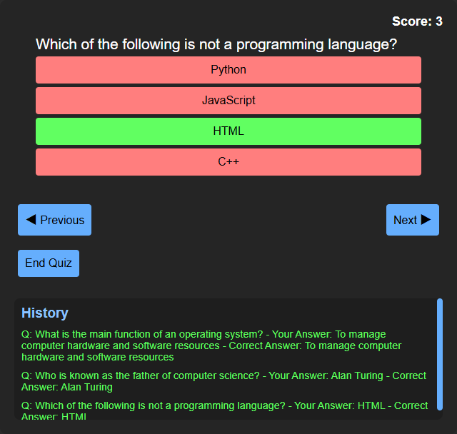

# Quiz App

## Overview
This project is a web-based quiz application designed to provide users with an interactive experience. It features multiple-choice questions on various topics, ensuring an engaging user interaction. The app is built with a focus on responsive design to ensure optimal usability across different devices and screen sizes.

## Features
- **Interactive Quiz**: Engaging multiple-choice questions on various topics.
- **Responsive Design**: Ensures usability and functionality across desktop, tablet, and mobile devices.
- **Score Tracking**: Keeps track of users' scores and provides feedback at the end of the quiz.
- **User-Friendly Interface**: Intuitive design for easy navigation and interaction.

## Technologies Used
- **Frontend**: HTML, CSS, JavaScript (ES6+)
- **Frameworks/Libraries**: Bootstrap (for responsive design), jQuery (for DOM manipulation)
- **Version Control**: Git, GitHub (for project management and collaboration)

## Installation and Usage
1. Clone the repository:
2. Open `index.html` in your preferred web browser.

## How to Contribute
Contributions are welcome! Here's how you can contribute to the project:
- Fork the repository.
- Create a new branch (`git checkout -b feature/new-feature`).
- Make your changes.
- Commit your changes (`git commit -am 'Add new feature'`).
- Push to the branch (`git push origin feature/new-feature`).
- Create a new Pull Request.

## Credits
- Author: Raju Ghimire
- Email: rajughimire024@gmail.com
- GitHub: [Your GitHub Profile](https://github.com/your-username)

