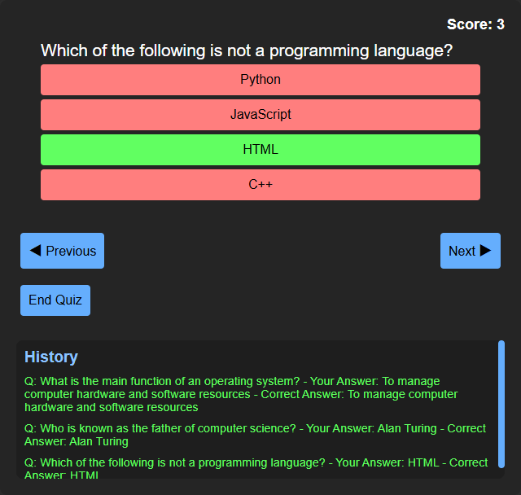

# Quiz App

## Overview
This project is a web-based quiz application designed to provide an interactive experience with multiple-choice questions on various topics. It emphasizes responsive design for optimal usability across devices.

## Features
- **Interactive Quiz**: Engaging multiple-choice questions.
- **Responsive Design**: Ensures usability on desktop, tablet, and mobile.
- **Score Tracking**: Tracks user scores.
- **User-Friendly Interface**: Intuitive design for easy navigation.

## Technologies Used
- **Frontend**: HTML, CSS, JavaScript (ES6+)
- **Frameworks/Libraries**: None
- **Version Control**: Git, GitHub

## Installation and Usage
1. Clone the repository.
2. Open `index.html` in your web browser.

## How to Contribute
Contributions are welcome! Follow these steps:
- Fork the repository.
- Create a new branch (`git checkout -b feature/new-feature`).
- Make changes and commit (`git commit -am 'Add new feature'`).
- Push changes (`git push origin feature/new-feature`).
- Create a Pull Request.

## Credits
- Author: Raju Ghimire
- Email: rajughimire024@gmail.com
- GitHub: [Raju's GitHub Profile](https://github.com/helloiamraju)
